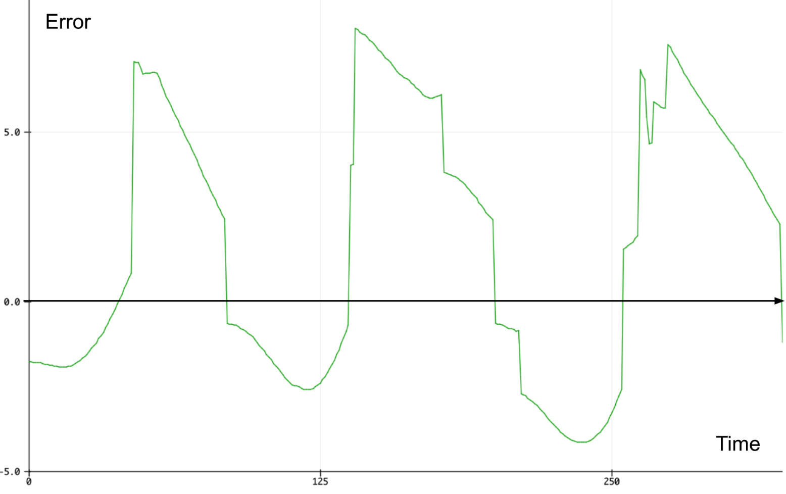
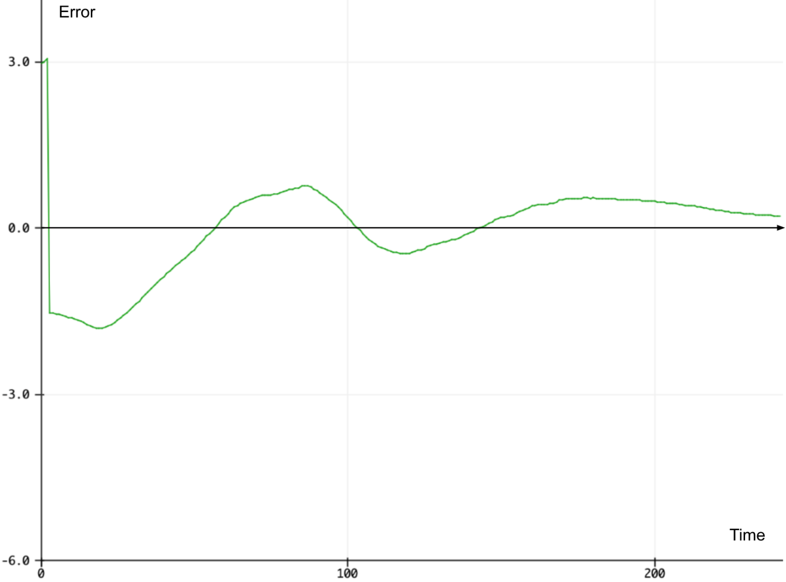
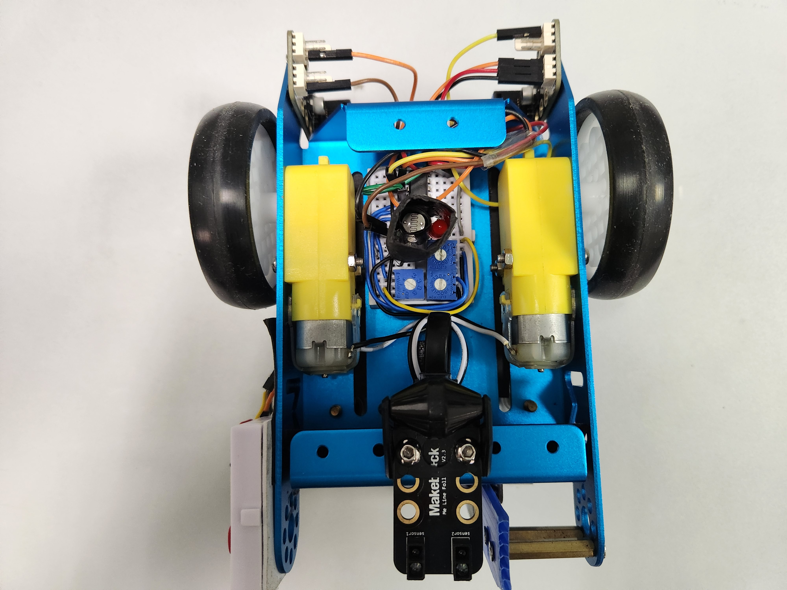

# Implementation Details

The full explanation of our robot implementation can be viewed in our report [here](./report.pdf).

<div align="center">


*Overall flowchart of our algorithm*

</div>

In order to achieve all the different functions such as moving forward, colour detection and turning, we made used of the `global_state` variable. It will consist of all the possible states the mBot can be in, given by the enum called `Motion`. Initially, the state will be set to `FORWARD` to ensure the mBot moves from the start. 

```c
enum Motion {
  TURN_LEFT, TURN_RIGHT, U_TURN, TWO_LEFT, TWO_RIGHT, CHALLENGE, FORWARD, FINISH
};
Motion global_state = FORWARD;  // Default state of motion is FORWARD (with PID)
```

Next, the state will be checked in each iteration of the main loop and the corresponding logic will be executed based on the current state of the mBot. The overall logic flow can be visualised in the flowchart above. 

```c
void loop() {
  if (global_state == FORWARD) {
    float correction = calculate_pid();
    if (correction == -1) move_forward();             // Applies deviation to the forward if no wall detected (found in b_navigation.ino)
    else move_forward_correction((int) correction);   // (int) as arduino motor speed is in int

    if (has_reached_waypoint()) {                     // Black line is detected, change state to CHALLENGE (sense the tile)
      stop_moving();
      global_state = CHALLENGE;
    }

  } else if (global_state == CHALLENGE) {
    ... // Color detection algorithm here
  } else if (global_state == TURN_LEFT) {
    ... // Code to turn left (RED)
  } 
  ... // Other turn logic below
}
```

## Navigation
The motors used on the mBot spin with different speeds in the real world due to manufacturing inaccuracies and other environmental factors. In our case, our mBot tends to **deviate left** when both motors are set to the same speed. Hence, our group implemented the **PID control algorithm** to keep the robot straight.

### Ultrasonic sensor
Measures the time taken for the ultrasonic waves to travel from the emitter to a surface and back into the receiver. The distance of the surface away from the sensor can then be computed. The ultrasonic sensor is used with the PID algorithm to maintain a constant distance away from the wall. 

Our ultrasonic sensor was **mounted higher** to prevent it from detecting additional objects on the field. The original mounting position was **too low** and misidentifies the additional edge of the table as a wall when a wall is removed. This causes the PID algorithm to apply unnecessary correction during missing wall segment. Additionally, mounting higher helped to **reduce the form factor** of the robot, reducing the chance of collision with walls.

### PID algorithm
The PID algorithm is a closed feedback control algorithm that aims to maintain a desired state of a system by making corrections based on the feedback it receives from a data source. It is made of 3 components: 

- **Setpoint**: The desired state that the system should achieve and maintain
- **Error**: The difference between the current state of the system and the desired state (setpoint)
- **Output**: The correction that needs to be applied to the system to correct the error and ensure the setpoint is reached

In the case of the mBot, the PID algorithm takes the distance measured by the ultrasonic sensor as input and outputs a motor correction that ensures that the mBot is 10 cm away from the wall regardless of other environmental influences like friction or unequal motor speeds. When contextualising the terms used in the PID algorithm:

1. **Setpoint** (desired state): the mBot positioned ideally 10 cm away from the right wall at all times. 
2. **Error**: The difference between the current distance the mBot is from the right wall (read by the ultrasonic sensor) and the desired state of 10 cm. 
3. **Output**: The motor speed correction that would bring the mBot to just 10 cm away from the wall without significant over or under correction. 

When computing the PID output, the distance away from the right wall is first obtained from the ultrasonic sensor. If the returned value is 0 or greater than 15 cm, it is likely that there is **no wall present** on the right. In our implementation, if there is no wall present, the mBot will simply move forward without any correction. 

Otherwise, the algorithm consists of 3 parts, the P (proportional), I (integral) and D (derivative) controllers given by the equation above. Each controller has an individual gain Kp, Ki and Kd which needs to be tuned for the algorithm to converge to the setpoint quickly and without oscillation around the setpoint. 

```c
/* Code implementation of the PID algorithm: */
float calculate_pid() {
    float wall_dist = get_ultrasonic_distance();

     // If wall is not present, return -1
    if (wall_dist == 0.0 or wall_dist > PID_SETPOINT * 1.5) {
        pid_i_mem = 0.0; prev_pid_error = 0.0;
        return -1;
    }
    
    float pid_error = filtered_dist - PID_SETPOINT; // Calculate PID error

    float P_controller = PID_P_GAIN * pid_error;
    pid_i_mem += PID_I_GAIN * pid_error; // Accumulate error for I controller
    float D_controller = PID_D_GAIN * (pid_error - prev_pid_error);

    float pid_output = P_controller + pid_i_mem + D_controller; // Put them together

    prev_pid_error = pid_error; // Update previous error
    return pid_output;
}
```

The PID output is then applied to the base motor speed using the function below. If the output is positive, it signifies that the error is positive and hence the mBot is too far away from the wall (i.e. distance > setpoint 10 cm). Thus, the mBot should correct to the right with greater speed on the right wheel and slower speed on the left. The reverse is true if the output is negative. This is implemented as follows: 

```c
void move_forward_correction(int correction) {
  left_motor.run(-FORWARD_SPEED - correction);
  right_motor.run(FORWARD_SPEED - correction);
}
```

When there is no wall detected on the right, the mBot will simply move forward without any PID correction. This is implemented with the move_forward() function where individual deviation constants are applied to the base speed for each motor. For our case, we decided to intentionally make the robot **deviate left** to compensate for the slight right turns that it makes when it detects no walls. 

```c
void move_forward() {
  left_motor.run(-FORWARD_SPEED + LEFT_DEVIATION);
  right_motor.run(FORWARD_SPEED - RIGHT_DEVIATION);
}
```

To tune the PID controller, we set both the I and D gains to 0 and increased the P gain until there is constant oscillations around the setpoint.

<div align="center">



*P-controller only*

</div>

Next, we leave the P-gain and start increasing the D gain. We can see that the introduction of the D controller will help the mBot reach the setpoint albeit with some oscillations around the setpoint.

<div align="center">



*PD controller with small D-gain*

</div>

At the optimal D gain, we can see that there is no significant oscillations and overshooting of error. The mBot also converges to the setpoint relatively quickly. 

<div align="center">


*PD controller with optimal P and D gains*

</div>

Since there is no persistent error in our system, there is no need to accumulate the error over time and hence the I gain is left at zero.

<div align="center">

| P_gain | I_gain | D_gain |
|:------:|:------:|:------:|
|  30.0  |   0.0  |  800.0 |

*Final PID gain we used for graded runs*

</div>

### Low-pass Filter
One issue with the PID controller is that **noise** from the input (ultrasonic) signal affects the output of the D (Differential) controller significantly enough to cause **jitters** in the robot's movements. 

The rate of change of a noisy/choppy signal is likely to fluctuate significantly as seen by how the gradient changes rapidly on a curve that increases and decreases relatively quickly over a small time step. Since the D controller computes the rate of change of error and applies it to the overall PID output, this would cause the output to be noisy/choppy as well. This effect is further amplified if a large D gain is used to dampen the change in error as this rapidly changing rate of change component would become a larger component of the overall output. 

```c
/* Code implementation of digital low pass filter: */
const float low_pass_alpha = 0.05;
filtered_signal = (1-low_pass_alpha) * prev_signal + (low_pass_alpha * new_distance);  
```

To address this issue, a digital low-pass filter is applied to the input distance signal to smooth the distance readings from the ultrasonic sensor. As seen in the graph below, the line in red shows the distance readings with the low pass filter applied which is much smoother than the original signal in green. There is a noticeable lag in the filtered red signal due to the phase shift of the low-pass filter but this lag is not significant enough to affect the PID algorithm. 

<div align="center"> 


*Digital low pass filter (Red) applied to original distance reading from ultrasonic sensor (Green)*

</div>

However, when there is a sudden change in the distance reading, the low-pass filter will take a while to respond and reach the new distance reading immediately. Sudden changes in distance readings occur when the mBot detects missing walls or detects a wall again. 

This is because based on the code above, a large part of the filtered signal is based on its previous reading. Only a small portion of the new distance reading is taken into account, thus large changes would not affect the filtered significantly.

<div align="center"> 


*Digital low-pass filter that brings filtered signal to raw reading if there is sudden change* 

</div>

This is addressed by bringing the value of the filtered signal to the current distance reading immediately if the difference between the actual distance reading and the previous value is larger than a pre-defined threshold value. 

```c
const float initial_threshold = 3.0;
if (abs(new_distance - prev_signal) > initial_threshold)
    filtered_signal = new_distance; 
```

## Colour Detection
All colours are made of varying amounts of the three primary colours - red, green and blue. A colour of an object can be determined by the amount of red, green and blue light reflected from a particular coloured surface. For example, a red surface will absorb green and blue light and most red light will be reflected for our eyes to detect the surface is red. 

Our colour sensor consists of a light dependent resistor (LDR) which will measure the intensity of red, green and blue light reflected from the tile.  The colour of the tile is determined by comparing against the known characteristic RGB light reflected from each of the possible coloured tiles. (Red, Orange, Purple, Green, Blue and White)

### Hardware
In this project, we built a colour sensor using three separate LEDs, an LDR and a 2-to-4 decoder.

<div align="center">


*Colour Sensing Circuit*

</div>

- As we have a limited number of pins to work with, we used the 2-to-4 decoder such that only 2 pins (A2 & A3) from the mBot are needed to control the 3 LEDs. 
- At fixed intervals, we changed the state (HIGH or LOW) of pins A2 and A3 to switch on each LED and take the voltage divider reading of the LDR from pin A0.
- The program then calculates these values to match the RGB colour code, where each value is between 0 - 255

<div align="center">

|    Colour   |    A2   |   A3  |
|:-----------:|:-------:|:-----:|
|   Red LED   |   HIGH  |  HIGH |
|  Green LED  |   LOW   |  HIGH |
|   Blue LED  |   HIGH  |  LOW  |

*Input signal to 2-to-4 decoder to operate different LEDs* 

</div>

The RGB readings of the colour sensor would change drastically when tested on different fields. This is likely because the components of the colour sensing circuit is not properly secured and the LEDs and LDR would shift slightly when we brought the mBot around. 

To fix this, we built a cylinder around the LDR and then surrounded it with the 3 LEDs and another cylinder around everything. The LEDs were made shorter to prevent movement. Together this ensures that the LEDs will be firmly secured to the LDR, reducing the possibility of movement. Additionally, this serves to block out ambient light which increases the reliability of colour detection. 

<div align="center">



*Underside of robot with colour detection circuit and setup*

</div>

### Software Implementation

The raw reflected red, green and blue light read from the LDR and will be stored in a global integer array currentColor[3] (0 = Red, 1 = Green, 2 = Blue).

<div align="center">


*Flowchart for colour recognition*

</div>

1. Firstly, we check if the tile is **white** since white should have around **max values** for *all* RGB components as it should reflect all colours of light. Hence we check if reflected red, green and blue values are greater than `WHITE_THRESHOLD` (200).

2. Next, we noticed that the reflected red light is much greater for red and orange tiles as compared to green, blue and purple tiles. Thus, if the tile is not white, we move on to check if reflected red is greater than `RED_THRESHOLD` (200). If true, the tile is either *red* or *orange*, else the tile is either *green*, *blue* or *purple*.

    1. **Red and Orange** 

        Between red and orange, we observed that the reflected green light is greater for an orange tile than a red tile since red colour should mostly reflect red light. Hence, we further check if green is greater than `RED_ORANGE_THRESHOLD` (120). If true, the tile is **orange**, else the tile is **red**.

    2. **Purple, Green and Blue**

        We realised that purple tiles should have more reflected red light as compared to blue and green tiles. Hence we check if reflected red is greater than green reflected light. 
        
        However, under dimmer ambient light conditions, there might be more green light reflected than red. Regardless, the amount of red and green light reflected is very similar for purple tile.

        Hence, we check if firstly there is more red than green light reflected. If that is not the case, we check if  the percentage difference between green and red is smaller than  `PURPLE_BLUEGREEN_THRESHOLD` (20%). If either condition is true, the tile below is **purple**.

        - **Green and Blue**

            Blue tiles will have more blue light reflected while green tiles will have more green light reflected. Thus we simply check if reflected green is greater blue. If there is more green than blue reflected light, the tile is **green**, else the tile is **blue**.

### Storing calibrated values in EEPROM
The calibrated balanceArray is stored on the EEPROM, which can be likened to the mBot’s onboard memory. This allows us to store the black RGB values and the (white - black) range RGB values from colour calibration to the mBot. This eliminates the need to manually insert those calibrated values into the main project project code which is inefficient and prone to error. At the start of the main program, the values of balanceArray will be retrieved programmatically from the EEPROM. 

## Limitations

We did not implement the IR sensor due to the lack of reliable readings from the sensor. We were not able to get consistent analog readings and thus we decided to spend more time enhancing the robustness of our colour sensor and PID algorithm. 

- Colour sensor: Must be consistent at all times regardless of ambient light conditions to correctly identify the next turn to perform to traverse the maze successfully. 

- PID algorithm: Must be able to keep the robot straight just using the right wall. Any deviations must be corrected relatively quickly so that the robot does not veer off and hit a wall. 

By ensuring the reliability of both the colour sensor and PID algorithm, eliminate the need of the IR sensor on the left and traverse the maze without collision with walls. 

However, there are very few edge cases where the robot will veer off course and an IR sensor would have helped completely eliminate such issues. Perhaps if there was more time, we could have implemented the IR circuit properly into our robot. 

### Infrared sensor

The IR circuit that we tested and implemented is as follows: 

