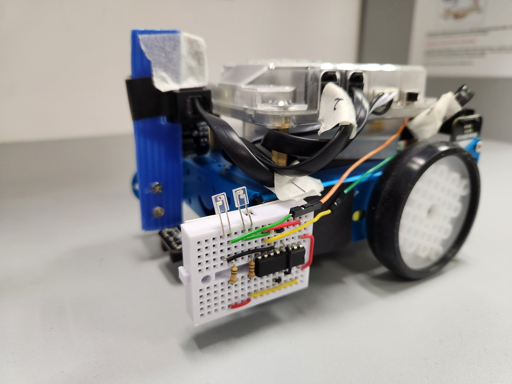
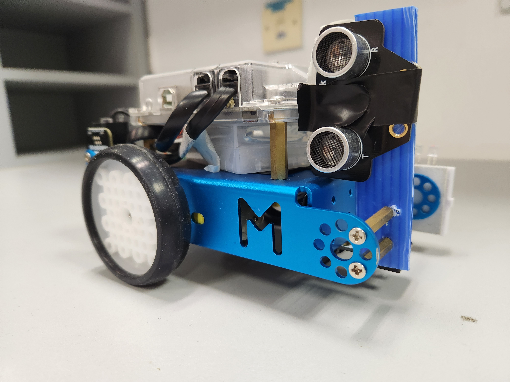
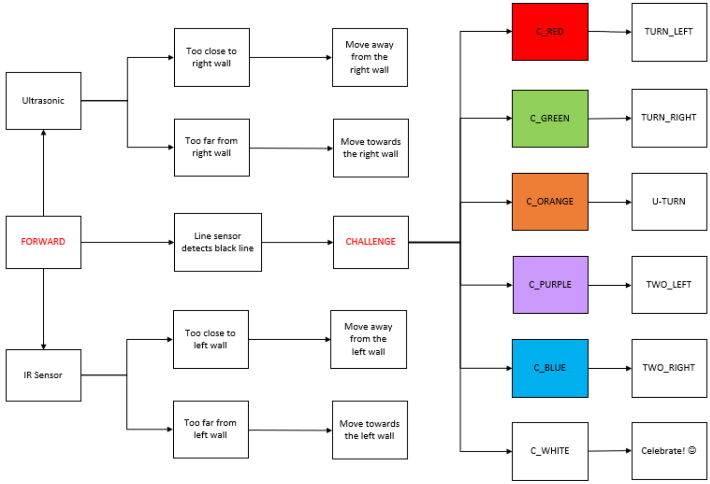
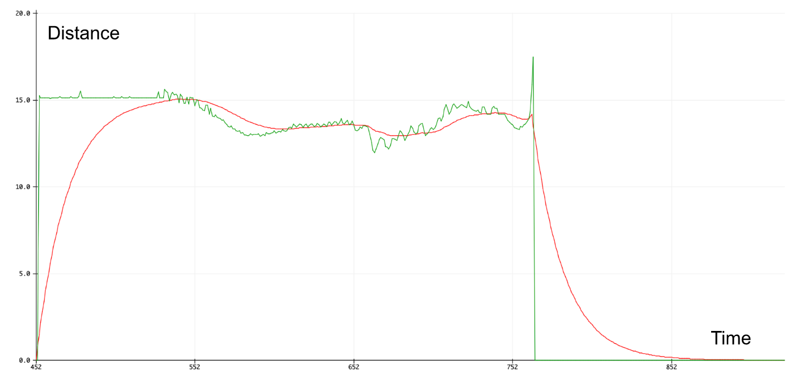
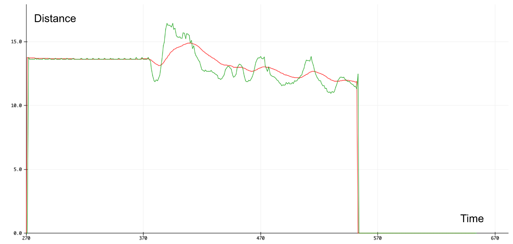
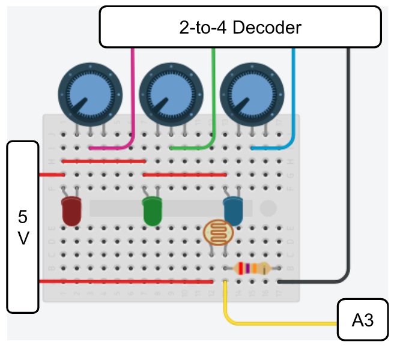
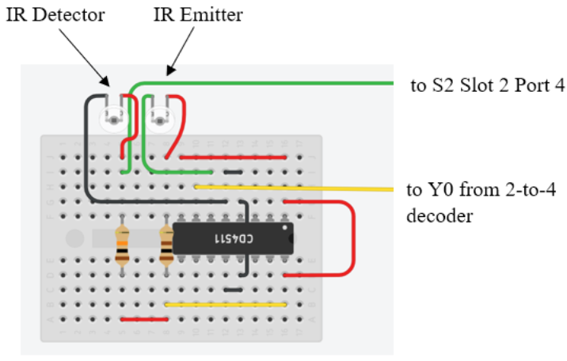

# The A-maze-ing Race Project [CG1111A]
Year 1 Semester 1 mBot robot finale project for CG1111A module. 

We are tasked to build a mBot robot that can find its way through a maze in the shortest time. Similar to the TV program, there will be challenges along the way in the form of colored tiles that signify the next direction the robot needs to head towards to complete the maze. There are walls that surround the maze and the robot needs to avoid them while traversing the maze.

Pictures of our mBot project: 
|  |  |
|:-:|:-:|
| Left side (IR sensor) | Right side (ultrasonic sensor) |

## Installation
First run `color_calibration.ino` to calibrate the light sensor. You will be instructed to place a white piece of paper followed by a black piece of paper below the mBot. Once calibration is complete, the program will show the raw RGB values it is currently sensing.

Next, run the main program `project.ino`. Other files including `a_utility.ino`, `b_navigation.ino`, `c_periperhals.ino` and `d_sensor.ino` are tabs to the main ino file and should be compiled together. Ensure that they are recognised as tabs for the program to compile correctly. 

## Overview
<div align="center">


*Overall flowchart of our algorithm*

</div>

## Navigation
The motors used on the mBot spin with different speeds in the real world due to manufacturing inaccuracies and other environmental factors. In our case, our mBot tends to **deviate left** when both motors are set to the same speed. Hence, our group implemented the **PID control algorithm** to keep the robot straight.

### Ultrasonic sensor
Measures the time taken for the ultrasonic waves to travel from the emitter to a surface and back into the receiver. The distance of the surface away from the sensor can be computed by finding the product of half the time taken and the speed of sound (around 340 m/s). The ultrasonic sensor is used with the PID algorithm to maintain a constant distance away from the wall. 

The position of the ultrasonic sensor on the mBot was crucial because it affected the ability for the robot to identify missing walls. The original mounting position was **too low** and misidentifies the additional edge of the table as a wall when a wall is removed. This causes the PID algorithm to apply unnecessary correction during missing wall segment. To address this issue, the ultrasonic sensor was **mounted higher** which prevented it from detecting additional objects on the field. 

### PID algorithm
The PID algorithm is a closed feedback control algorithm that aims to maintain a desired state of a system by making corrections based on the feedback it receives from a data source. It is made of 3 components: 

- **Setpoint**: The desired state that the system should achieve and maintain
- **Error**: The difference between the current state of the system and the desired state (setpoint)
- **Output**: The correction that needs to be applied to the system to correct the error and ensure the setpoint is reached

In the case of the mBot, the PID algorithm takes the distance measured by the ultrasonic sensor as input and outputs a motor correction that ensures that the mBot is 10 cm away from the wall regardless of other environmental influences like friction or unequal motor speeds. When contextualising the terms used in the PID algorithm:

1. **Setpoint** (desired state): the mBot positioned ideally 10 cm away from the right wall at all times. 
2. **Error**: The difference between the current distance the mBot is from the right wall (read by the ultrasonic sensor) and the desired state of 10 cm. 
3. **Output**: The motor speed correction that would bring the mBot to just 10 cm away from the wall without significant over or under correction. 

When computing the PID output, the distance away from the right wall is first obtained from the ultrasonic sensor. If the returned value is 0 or greater than 15 cm, it is likely that there is **no wall present** on the right. In our implementation, if there is no wall present, the mBot will simply move forward without any correction. 

Otherwise, the algorithm consists of 3 parts, the P (proportional), I (integral) and D (derivative) controllers given by the equation above. Each controller has an individual gain Kp, Ki and Kd which needs to be tuned for the algorithm to converge to the setpoint quickly and without oscillation around the setpoint. 

```c
/* Code implementation of the PID algorithm: */
float calculate_pid() {
    float wall_dist = get_ultrasonic_distance();

     // If wall is not present, return -1
    if (wall_dist == 0.0 or wall_dist > PID_SETPOINT * 1.5) {
        pid_i_mem = 0.0; prev_pid_error = 0.0;
        return -1;
    }
    
    float pid_error = filtered_dist - PID_SETPOINT; // Calculate PID error

    float P_controller = PID_P_GAIN * pid_error;
    pid_i_mem += PID_I_GAIN * pid_error; // Accumulate error for I controller
    float D_controller = PID_D_GAIN * (pid_error - prev_pid_error);

    float pid_output = P_controller + pid_i_mem + D_controller; // Put them together

    prev_pid_error = pid_error; // Update previous error
    return pid_output;
}
```

The PID output is then applied to the base motor speed using the function below. If the output is positive, it signifies that the error is positive and hence the mBot is too far away from the wall (i.e. distance > setpoint 10 cm). Thus, the mBot should correct to the right with greater speed on the right wheel and slower speed on the left. The reverse is true if the output is negative. This is implemented as follows: 

```c
void move_forward_correction(int correction) {
  left_motor.run(-FORWARD_SPEED - correction);
  right_motor.run(FORWARD_SPEED - correction);
}
```

When there is no wall detected on the right, the mBot will simply move forward without any PID correction. This is implemented with the move_forward() function where individual deviation constants are applied to the base speed for each motor. For our case, we decided to intentionally make the robot **deviate left** to compensate for the slight right turns that it makes when it detects no walls. 

```c
void move_forward() {
  left_motor.run(-FORWARD_SPEED + LEFT_DEVIATION);
  right_motor.run(FORWARD_SPEED - RIGHT_DEVIATION);
}
```

<div align="center">

| P_gain | I_gain | D_gain |
|:------:|:------:|:------:|
|  30.0  |   0.0  |  800.0 |

*Final PID gain we used for graded runs*

</div>

### Low-pass Filter
One issue with the PID controller is that **noise** from the input (ultrasonic) signal affects the output of the D (Differential) controller significantly enough to cause **jitters** in the robot's movements. 

The rate of change of a noisy/choppy signal is likely to fluctuate significantly as seen by how the gradient changes rapidly on a curve that increases and decreases relatively quickly over a small time step. Since the D controller computes the rate of change of error and applies it to the overall PID output, this would cause the output to be noisy/choppy as well. This effect is further amplified if a large D gain is used to dampen the change in error as this rapidly changing rate of change component would become a larger component of the overall output. 

```c
/* Code implementation of digital low pass filter: */
const float low_pass_alpha = 0.05;
filtered_signal = (1-low_pass_alpha) * prev_signal + (low_pass_alpha * new_distance);  
```

To address this issue, a digital low-pass filter is applied to the input distance signal to smooth the distance readings from the ultrasonic sensor. As seen in the graph below, the line in red shows the distance readings with the low pass filter applied which is much smoother than the original signal in green. There is a noticeable lag in the filtered red signal due to the phase shift of the low-pass filter but this lag is not significant enough to affect the PID algorithm. 

<div align="center"> 


*Digital low pass filter (Red) applied to original distance reading from ultrasonic sensor (Green)*

</div>

However, when there is a sudden change in the distance reading, the low-pass filter will take a while to respond and reach the new distance reading immediately. Sudden changes in distance readings occur when the mBot detects missing walls or detects a wall again. 

This is because based on the code above, a large part of the filtered signal is based on its previous reading. Only a small portion of the new distance reading is taken into account, thus large changes would not affect the filtered significantly.

<div align="center"> 


*Digital low-pass filter that brings filtered signal to raw reading if there is sudden change* 

</div>

This is addressed by bringing the value of the filtered signal to the current distance reading immediately if the difference between the actual distance reading and the previous value is larger than a pre-defined threshold value. 

```c
const float initial_threshold = 3.0;
if (abs(new_distance - prev_signal) > initial_threshold)
    filtered_signal = new_distance; 
```

## Color Detection
All colours are made of varying amounts of the three primary colours - red, green and blue. A colour of an object can be determined by the amount of red, green and blue light reflected from a particular coloured surface. For example, a red surface will absorb green and blue light and most red light will be reflected for our eyes to detect the surface is red. 

Our colour sensor will measure the intensity of red, green and blue light reflected from the object and determine its colour based on the known characteristic RGB components of light reflected from each of the coloured tiles. (Red, Orange, Purple, Green, Blue and White)

### Hardware
In this project, we built a colour sensor using three separate LEDs, an LDR and a 2-to-4 decoder.

<div align="center">



*Colour Sensing Circuit*

</div>

- As we have a limited number of pins to work with, we used the 2-to-4 decoder such that only 2 pins (A2 & A3) from the mBot are needed to control the 3 LEDs. 
- At fixed intervals, we changed the state (HIGH or LOW) of pins A2 and A3 to switch on each LED and take the voltage divider reading of the LDR from pin A0.
- The program then calculates these values to match the RGB colour code, where each value is between 0 - 255

<div align="center">

|    Colour   |    A2   |   A3  |
|:-----------:|:-------:|:-----:|
|   Red LED   |   HIGH  |  HIGH |
|  Green LED  |   LOW   |  HIGH |
|   Blue LED  |   HIGH  |  LOW  |

*Input signal to 2-to-4 decoder to operate different LEDs* 

</div>

### Software Implementation

<div align="center">


*Flowchart for color recognition*

</div>

### Storing calibrated values in EEPROM
The calibrated balanceArray is stored on the EEPROM, which can be likened to the mBot’s onboard memory. This allows us to store the black RGB values and the (white - black) range RGB values from colour calibration to the mBot. This eliminates the need to manually insert those calibrated values into the main project project code which is inefficient and prone to error. At the start of the main program, the values of balanceArray will be retrieved programmatically from the EEPROM. 

## Limitations

### Infrared sensor

<div align="center">



*IR Sensor Circuit*

</div>