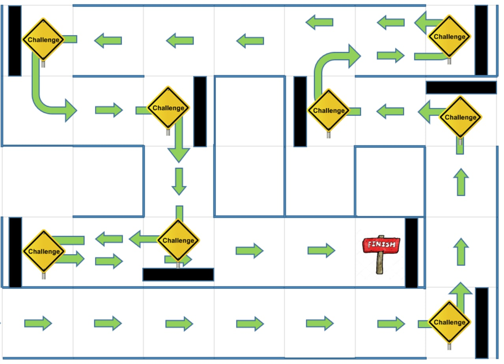
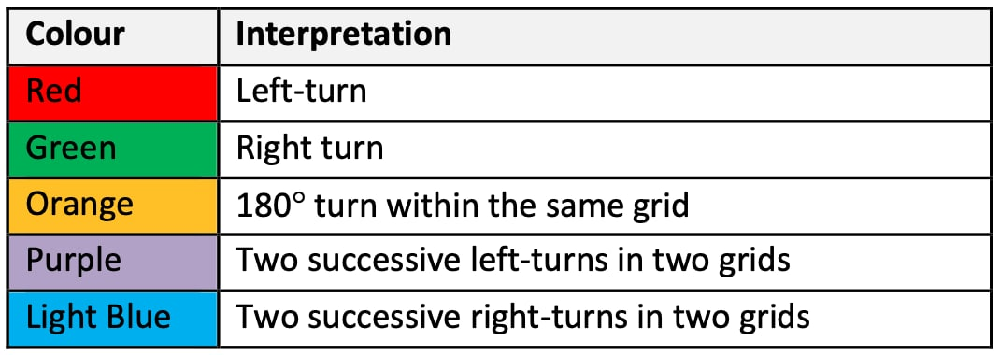
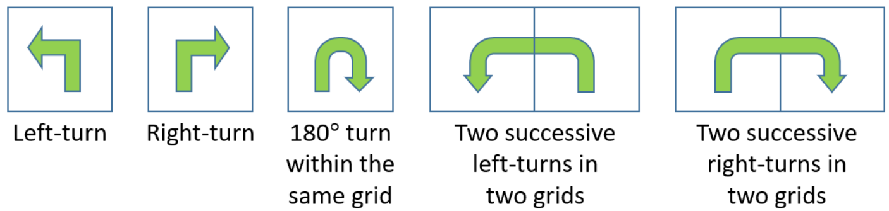

# The A-maze-ing Race Project

## Year 1 Semester 1 mBot robot finale project for CG1111A module. 

We are tasked to build a mBot robot that can find its way through a maze in the shortest time. There will be challenges along the way in the form of coloured tiles that signify the next direction the robot needs to head towards to traverse the maze. There are walls surrounding the maze and the robot needs to avoid them while navigating the maze.

Pictures of our mBot project: 
|  |  |
|:-:|:-:|
| Left side (Infrared sensor) | Right side (Ultrasonic sensor) |

## Maze details

Our robot is tasked to navigate through a maze similar to the one shown below. It must not hit any walls at the sides indicated by blue lines.

*A sample maze layout*

While navigating the maze, a waypoint challenge will be indicated with a **black strip** on the maze floor. A waypoint challenge is simply a colored tile on the floor. There are 5 different possible colors, **red**, **orange**, **green**, **blue** and **purple**. Each color represents a type of turn  the robot needs to execute to correctly traverse the maze. 

At the end of the maze, the colour of the paper underneath the mBot at the waypoint challenge will be **white** to signify the end.

*Colour interpretation for waypoint challenges*

*Five types of turns that our mBot needs to execute*

## Setting up the mBot

The following are the hardware connections to the mBot for our program to run correctly. 

<table>
<tr>
  <th style="text-align:center"> Motor connections </th>
  <th style="text-align:center"> mBot sensor connections </th>
</tr>
<tr><td>

| Motor Port | Side |
|:----------:|:----:|
| **M1** | Left motor  |
| **M2** | Right motor |

</td><td>

| mBot port | Sensor |
|:---------:|:------:|
| **Port 1** |  Ultrasonic sensor   |
| **Port 2** | Line Follower sensor |

</td></tr> </table>

| Arduino | Component |
|:-------:|:---------:|
| **A0** | Light Dependent Resistor |
| **A1** |    Infrared Detector     |
| **A2** | **1A** of 2-to-4 decoder |
| **A3** | **1B** of 2-to-4 decoder |

Next, the light sensor will be calibrated by running `color_calibration.ino`. You will be instructed to place a **white** piece of paper followed by a **black** piece of paper below the mBot. Once calibration is complete, the program will show the raw RGB values it is currently sensing.

Lastly, run the main program `project.ino`. Other files including `a_utility.ino`, `b_navigation.ino`, `c_periperhals.ino` and `d_sensor.ino` are tabs to the main ino file and should be compiled together. Ensure that they are recognised as tabs for the program to compile correctly. 

## Implementation

A brief description of the sensors used in our implementation is as follows:

| Sensor | Purpose |
|:-------|:--------|
| Ultrasonic sensor | Mounted on the **right** side of mBot intended to detect proximity to walls on the right. However, as the IR sensor was not used, we implemented the **PID algorithm** to ensure the robot maintains a ideal distance of **10 cm** away from the right wall. The distance measured by the ultrasonic sensor was used as input to the PID algorithm.   A **digital low-pass filter** was implemented to reduce noise in the ultrasonic readings to further improve the performance of the PID algorithm. |
| mBot line follower | Mounted at the **front** of mBot **facing downwards** to detect the black line on the floor which indicates the presence of a waypoint challenge |
| Custom color sensor | Mounted at the **bottom** of mBot **facing downwards** to identify the color of the tile at a waypoint challenge. The corresponding turn can then be executed to navigate the maze. <ul><li>Made out of red (R), green (G) and blue (B) LEDs and a Light dependent resistor. Each LED will be lit up for **100 ms** and the LDR measures the intensity of reflected light for each color.</li><li>The color of the surface can be identified by comparing the intensities of reflected R, G and B light with a set of predetermined conditions based on the characteristics of each colored surface.</li><li>A black skirt is added around the LEDs and LDR to block out ambient light that could potentially add noise to the measurements. </li></ul> |
| Infrared sensor | Intended to detect left wall but not used due to [lack of reliability](#limitations) |

A more detailed explanation of our implementation can be found [here](Implementation.md).

The full explanation of our robot implementation can be viewed in our group report [here](report.pdf).

## Limitations

We did not implement the IR sensor due to the **lack of reliable readings** from the sensor. We decided to focus on improving the robustness of our colour sensor and PID algorithm. 

There are a few edge cases where the robot will veer off course and an IR sensor would have helped completely eliminate such issues. Perhaps if there was more time, we could have implemented the IR circuit properly into our robot. 

## No walls? No problem!

Somehow the PID algorithm is able to navigate the maze even when there are no walls. It does so by applying corrections to the robot's movements when the ultrasonic sensor detects the pillars on the field.

<video src="https://user-images.githubusercontent.com/20199469/206158900-2b9fe33c-d280-4145-bae2-6a3bd8c9a8fb.mp4" width=240></video>
